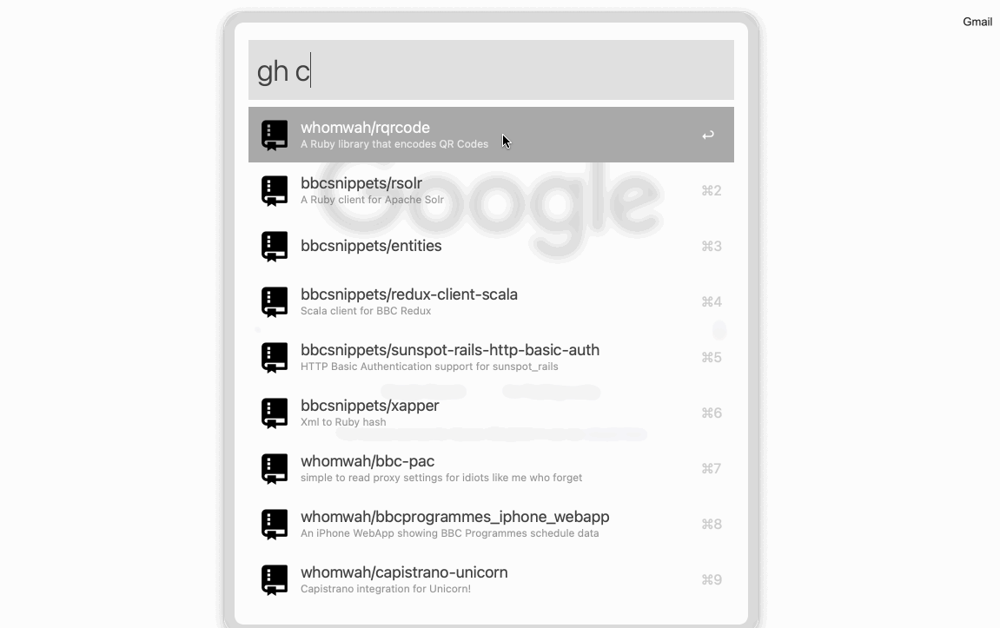

# An Alfred 5 Workflow for working with Github


[](https://github.com/semantic-release/semantic-release)

This workflow is inspired by
[Alfred workflow](https://github.com/gharlan/alfred-github-workflow) by
[Gregor Harlan](https://github.com/gharlan). It uses [Deno](https://deno.land/).
It's written in [TypeScript](https://www.typescriptlang.org/). It contains many
of the high level features in the original.

It runs really fast via the `deno` executable having been bundled into `js` in
`deno` and minified via [`esbuild`](https://esbuild.github.io/).



## Install

The project and workflow requires the [Deno](https://deno.land/) binary to be
installed. This can be done simply from the [Deno](https://deno.land/) website
above.

> [Deno](https://deno.land/) is a runtime for JavaScript.
> [Deno](https://deno.land/) was co-created by Ryan Dahl, who also created
> Node.js.

Once installed you can
[download the latest version](https://github.com/whomwah/alfred-github-workflow/releases/latest)
and double click the `.workflow` file to open and install or update.

## Usage

By default you access the workflow via the `gh` command.

The first time you use the workflow you will need an access token so the
workflow can speak to github on your behalf. You can do this via the
`gh > login` command. Pressing enter will take you to an authorisation page on
Github. The permissions are used only by the workflow.

There are a few top level commands and other than that you just start typing a
`repo` or `user` you are interested in. Once you start seeing results, pressing
the auto complete key (⇥ by default) will show you any other sub commands
available.

```bash
# Settings

gh > ...

# User commands

gh @...

# Your personal commands

gh my ...

# Your gists

gh gists ...

# Anything else

gh ...
```

### updates

You find out the latest version by looking at the
[release section](https://github.com/whomwah/alfred-github-workflow/releases) of
the repo. The workflow will also let you know if there is an update available.
This can be disabled via the workflow configuration area along with other
configurable options.

## Development

You will first need to install `deno` as mentioned earlier in this README.

### Tests

`deno task test`

### Formatting

`deno fmt`

### Local dev on an installed workflow

You can work locally with your checked out version of the repo and Alfred by
first installing the latest version of the workflow. You can then update the
environment variable `INIT_PATH` from
[within the workflow in Alfred](https://www.alfredapp.com/help/workflows/advanced/variables/#environment).
to point to your local `mod.ts` file in the repo. Note: This will only use your
local source code. Any icons are served from the workflow installed. You can get
to this folder by right clicking on the workflow in Alfred and choosing
`Open in Finder`.

### Build your own workflow

You can also build your own version of the workflow with:

```
./bin/build_release <version>

# example

./bin/build_release 1.2.3
```

## Resources

- Alfred App:: https://www.alfredapp.com/
- The inspiration for this version::
  https://github.com/gharlan/alfred-github-workflow

## Copyright

MIT License (http://www.opensource.org/licenses/mit-license.html)
